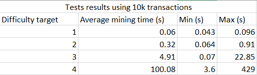

# Vladacoinas
## About
The goal of this project is to simulate the blockchain mining process using a custom hashing function ([Vladahashas](https://github.com/VKG147/Vladahashas)).

## How does it work?

### [v0.1](https://github.com/VKG147/Vladacoinas/releases/tag/v0.1)
1) Two ```.dat``` files containing mock data are generated:
* ```users.dat``` - randomly generated users (public key, name, balance)
* ```transactions.dat``` - randomly generated transactions (sender key, receiver key, amount)<br/>

2) The data is loaded into two ```std::deque``` containers
3) An instance of a ```VCoin::BlockChain``` is initialized with a genesis block
4) 100 random transactions are selected from the pool and are added to a block
5) A ```VCoin::Miner``` instance is created and the ```.mine(VCoin::VBlock block)``` function is called
6) When the mining is completed and a suitable nonce is found so that the hash of the block meets a set difficulty (currently 2 leading zeroes) it is added to the blockchain
7) ```users.dat``` and  ```transactions.dat``` files are updated
8) Steps 4-7 are repeated until there are no more transactions in the pool

### [v0.2](https://github.com/VKG147/Vladacoinas/releases/tag/v0.2)
In this version 5 miners are simulated on 5 physical cores using [OpenMP](https://www.openmp.org/). Once a miner successfully mines a block it is added to the blockchain. Also, balance, transaction validation is included in this version. 

#### Analysis
Here are some results of mining simulations of varying difficulty target:<br/>


## How to run it?
Compile with your favorite C++ compiler (CMakeLists.txt file included) and simply execute it (no arguments needed as of now).
